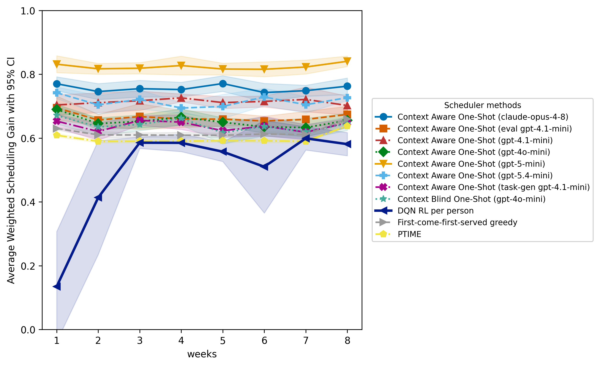
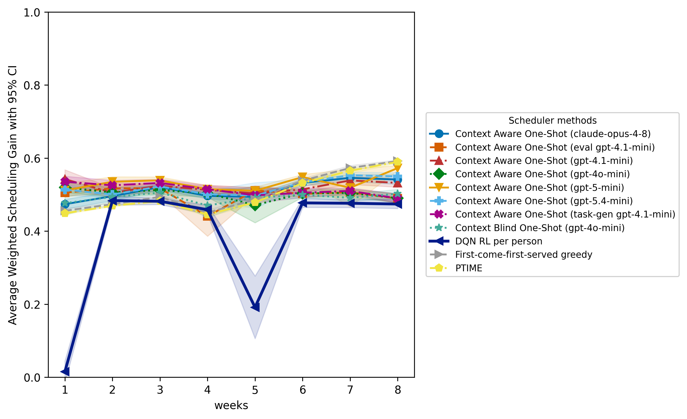

# CalendarBench

[](https://www.python.org/)
[](docker-compose.yml)
[](LICENSE)
[](paper/LICENSE)
[](.logs/coverage.txt)
[](CONTRIBUTING.md)
[](https://buymeacoffee.com/maani)

[](https://neo4j.com/)
[](https://redis.io/)
[](https://pytorch.org/)
[](https://github.com/Z3Prover/z3)
[](#2a-optional-gpu-accelerated-image)
[](https://bioportal.bioontology.org/ontologies/CBHT)
[](https://bioportal.bioontology.org/ontologies/CBCTX)

A configurable benchmark framework for personal scheduling in the wild. It couples an ontology-backed **GraphRAG** system (curated behavior-change, nutrition, and physical-activity ontologies; catalog in [src/graphrag/ontology_metadata.py](src/graphrag/ontology_metadata.py)) with a persona-based simulator of a user's calendar and context trace, then augments and scores schedules with a multi-objective human-centric metric.

- Experiment configuration reference: [CONFIG.md](CONFIG.md)
- Running tests and coverage: [CONTRIBUTING.md](CONTRIBUTING.md)

## Example experiment

The repository ships a runnable example in [src/experiments/persona/example_experiment](src/experiments/persona/example_experiment): eight persons sampled from a single full-time employee persona over an eight-week horizon. It compares a greedy heuristic, PTIME, one-shot LLM planners with five models, and an online DQN reinforcement-learning scheduler. Full results, with per-component scheduling gain, weekly trajectories, cost, and prompt ablations, are in [docs/benchmark_report.md](docs/benchmark_report.md).



## Progressive Healthy Lifestyle Challenge (PHLC-2026)

[](docs/PHLC-2026)

The main competitive challenge of the benchmark, defined in [src/experiments/persona/healthy_lifestyle_promotion](src/experiments/persona/healthy_lifestyle_promotion): thirty persons over an eight-week horizon on a **progressive ramp**, where the weekly task batch grows from 10 to 38 and the difficulty band widens from Level 1 to Level 4 in three domains (nutrition, physical activity, mental wellbeing). It compares a greedy heuristic, PTIME, five one-shot LLM planners, and an online DQN scheduler under a rising scheduling load. On this challenge the greedy gap-filler and PTIME match or exceed the SOTA one-shot LLM planners, because a one-shot planner places a smaller share of the tasks as the weekly load grows, while the heuristics cover nearly all of them. The full report, per-component gain, and weekly trajectories are in [docs/PHLC-2026](docs/PHLC-2026).



## Project layout

```
src/
  graphrag/                     # ontology-backed GraphRAG pipeline
    config.py                   #   env-driven settings (Neo4j + LLM)
    neo4j_client.py             #   driver factory + n10s init
    embeddings.py               #   OpenAI / local embedder factory
    llm.py                      #   OpenAI / Anthropic / OpenRouter factory
    retriever.py                #   VectorCypherRetriever + graph-context Cypher
    retrieval_filters.py        #   attribute / scope filter allow-list + Cypher
    query_planner.py            #   NL question -> structured retrieval plan
    pipeline.py                 #   GraphRAG with citation-required prompt
    ontology_metadata.py        #   per-ontology catalog (titles, descriptions, sources)
  scripts/
    ask.py                      # GraphRAG question/answer CLI
    download_ontologies.py      # curl-fetch every ontology in the catalog
    import_ontologies.py        # bulk-import RDF/OWL via n10s
    build_embeddings.py         # batch-embed concept nodes, create vector index
    generate_healthtasks_ttl.py # build the HealthTasks ontology (TTL + JSON)
    persona/                    # persona pipeline: sample people, solve base calendars
    scenarios/                  # task generation, augmentation, evaluation
  experiments/persona/          # experiment YAML sets (five files each)
    example_experiment/         #   eight-person full-time-employee demo
    healthy_lifestyle_promotion/
  assets/
    ontologies/                 # downloaded source OWL / TTL files (gitignored)
    images/                     # figures + coverage badge
tests/
  conftest.py                   # fixtures + per-ontology parametrization
  test_imports.py               # :Ontology + sample URIs imported
  test_embeddings.py            # vector index online + per-ontology embeddings
  test_rag.py                   # per-ontology retriever brings that ontology
  test_e2e_fake_ontology.py     # end-to-end grounding honesty check
  integration/                  # heavier cross-component suites
  unit/                         # fast mocked tests (no Neo4j, no LLM)
docs/                           # benchmark report and planning notes
paper/                          # LaTeX source and figures (CC-BY-4.0)
output/                         # per-run artifacts (gitignored); see below
```

Each experiment is five YAML files under `src/experiments/persona/<name>/`. See [CONFIG.md](CONFIG.md) for the schema.

## Output layout

A run writes under `output/<experiment_id>/`:

```
output/example_experiment/
├── persons/                          # base calendars (persona pipeline)
├── fcfs_greedy/                      # one directory per scenario id
│   ├── tasks/                        # generated health tasks (shared across methods)
│   └── greedy/                       # one directory per augmentation method
│       ├── augmented/persons/        # per-person JSON solutions
│       ├── augmented/ics_per_person/ # ICS calendars (base + augmented)
│       └── evaluation/               # scheduling-loss report
└── informed_oneshot_gpt_4o_mini/
    └── llm_agent/
        ├── augmented/
        └── evaluation/
```

The `.ics` files import directly into Google Calendar / Outlook / Apple Calendar.

## Stack

- **Neo4j 5.20 community** with [`apoc`](https://neo4j.com/labs/apoc/) and [`neosemantics` (`n10s`)](https://neo4j.com/labs/neosemantics/) plugins for native RDF / OWL import.
- **Python service** running [`neo4j-graphrag`](https://neo4j.com/docs/neo4j-graphrag-python/), with pluggable LLMs (OpenAI / Anthropic / OpenRouter) and OpenAI embeddings (`text-embedding-3-small`, 1536 dim).
- **Redis 7-alpine sidecar** caches the `L_pref` preference mapping; it is wired automatically by `docker compose` and falls back to [`fakeredis`](https://github.com/cunla/fakeredis-py) when `REDIS_URL` is unset. See [CONFIG.md](CONFIG.md) for the metric and [Preference cache](#preference-cache-redis) below for operation.
- **CUDA-optional retrieval stack.** `environment.yaml -> compute.device` selects `cpu` / `cuda` / `auto`; the Dockerfile takes `--build-arg INSTALL_CUDA=1` to install a GPU build of PyTorch + sentence-transformers so the local embedding path runs on the host's NVIDIA GPU.
- **`docker compose`** manages the benchmark.

## Setup

### 1. Configure environment

```bash
cp .env.example .env
```

* Edit `.env`; set `OPENAI_API_KEY`, optionally `ANTHROPIC_API_KEY` and `OPENROUTER_API_KEY`.
* `NEO4J_USERNAME` must be `neo4j` (the image's bootstrap user is hard-coded).
* `NEO4J_DATABASE` must be `neo4j` on Community Edition (multi-database needs Enterprise).
* `BIOPORTAL_API_KEY` is needed to download most ontologies (free at [BioPortal Account](https://bioportal.bioontology.org/account)). Without it only the OBO Foundry sources (ENVO, FOODON) are downloaded.
* **GPU users only.** Set `EMBEDDING_PROVIDER=local` (and optionally `LOCAL_EMBEDDING_MODEL=BAAI/bge-small-en-v1.5`) in `.env`. OpenAI embeddings are remote and never touch the GPU, so leaving the default `openai` value silently disables every CUDA setting downstream.

### 2. Start the stack

```bash
docker compose up -d
```

Neo4j Browser is then available at [http://localhost:7474](http://localhost:7474) (login with the credentials from `.env`).

#### 2a. (Optional) GPU-accelerated image

The default `app` image is CPU-only. GPU mode requires three layers on the host plus a CUDA build of the image:

**1. Host driver.** `nvidia-smi` must succeed and report the CUDA runtime version (the `CUDA Version` column). Install / update your NVIDIA driver if it does not.

**2. NVIDIA Container Toolkit.** Lets the Docker daemon pass the GPU through to containers:

```bash
sudo apt-get install -y nvidia-container-toolkit
sudo systemctl restart docker
```

(See [NVIDIA's install guide](https://docs.nvidia.com/datacenter/cloud-native/container-toolkit/latest/install-guide.html) for non-Debian hosts.)

**3. CUDA build of the `app` image.** Two pieces have to match your driver, not "the latest available":

- the wheel **index URL** (`cuXYZ`), which CUDA the wheels target;
- the torch **version pin**, which CUDA those wheels actually bundle.

Why both: PyTorch 2.11.x dropped CUDA 12 and only ships CUDA 13 wheels (its `Requires:` line names `nvidia-cudnn-cu13`). If you do not pin the version, pip happily installs torch 2.11 even from a `cu126` index and the result fails on any driver that does not yet support CUDA 13:

```
RuntimeError: The NVIDIA driver on your system is too old
              (found version <NNNNN>).
```

(That `<NNNNN>` is the **maximum CUDA runtime your driver supports**, encoded as `major*1000 + minor*10`: `12070` is about 12.7, `12040` is about 12.4.)

Read the `CUDA Version:` column from `nvidia-smi` and pick a known-good combination from this table. All rows have wheels for **Python 3.13 and 3.14**, which is what the Dockerfile runs on:

| `nvidia-smi` CUDA Version | `CUDA_INDEX_URL=…/whl/` | `TORCH_PIN=` |
|---|---|---|
| 13.0+ | `cu128` | `torch==2.11.0` |
| 12.6 – 12.x (recommended) | `cu126` | `torch==2.10.0+cu126` |
| 12.4 – 12.5 | `cu126` | `torch==2.10.0+cu126` |
| < 12.4 | update the host driver |

Then build (substituting both values for your row). Pass `--no-cache` the first time so Buildkit does not reuse a stale layer from a previous CUDA attempt:

```bash
sudo docker compose -f docker-compose.gpu.yml build --no-cache \
  --build-arg INSTALL_CUDA=1 \
  --build-arg CUDA_INDEX_URL=https://download.pytorch.org/whl/cu126 \
  --build-arg TORCH_PIN=torch==2.10.0+cu126 \
  app
```

Neither `torch` nor `sentence-transformers` lives in [requirements.txt](requirements.txt); both are installed only by this step so CPU-only hosts do not have to download multi-GB GPU wheels.

**4. Pick the compose file matching your host.** Two self-contained compose files live at the repo root:

| File | Use when |
|---|---|
| [docker-compose.yml](docker-compose.yml) | CPU host (default). No GPU prerequisites. |
| [docker-compose.gpu.yml](docker-compose.gpu.yml) | GPU host with the driver + toolkit installed. Identical to the CPU file plus a `deploy.resources.reservations.devices: nvidia` block on the `app` service. |

For GPU mode pass `-f docker-compose.gpu.yml` to every `docker compose` invocation:

```bash
sudo docker compose -f docker-compose.gpu.yml up -d
sudo docker compose -f docker-compose.gpu.yml run --rm app …
```

**Smoke-test the stack** before running anything real:

```bash
sudo docker compose -f docker-compose.gpu.yml run --rm app \
    python -c "import torch; print(torch.cuda.is_available(), torch.cuda.get_device_name(0))"
```

That must print `True <your GPU>`. If it prints `False`, fix the driver / toolkit / build layer above before touching the pipeline. None of the steps that follow use the GPU silently; they raise a `RuntimeError` from `resolve_device()` because `environment.yaml` pins `compute.device: cuda`.

### 3. Download ontologies

Downloads the ontologies listed in [src/graphrag/ontology_metadata.py](src/graphrag/ontology_metadata.py) with `curl` into `src/assets/ontologies/`. It is idempotent, so files already on disk are skipped (use `--force` to re-download).

```bash
docker compose run --rm app python -m src.scripts.download_ontologies
```

(`download_ontologies` is a `curl` wrapper, no GPU needed even on the CUDA image; omit `--gpus all`.)

Useful flags:

```bash
# Re-download every ontology, even if cached:
docker compose run --rm app python -m src.scripts.download_ontologies --force

# Only download a subset:
docker compose run --rm app python -m src.scripts.download_ontologies --only BCIO BCTT OPE
```

### 4. Import ontologies into Neo4j

Runs `n10s.rdf.import.fetch` on every downloaded file and tags each ontology root with metadata.

```bash
docker compose run --rm app python -m src.scripts.import_ontologies
```

Verify (optional):

```bash
docker compose exec neo4j cypher-shell -u neo4j -p "$NEO4J_PASSWORD" \
  "MATCH (n:Resource) RETURN count(n);"
```

You should see roughly 700k-1.1M resources depending on which ontologies are present.

### 5. Build embeddings + vector index

Idempotent too, so already-embedded nodes are skipped. It costs a few cents of credit on the first run.

```bash
docker compose run --rm app python -m src.scripts.build_embeddings
```

> **Note.** `build_embeddings.py` always calls the **OpenAI** API directly (it does not honour `EMBEDDING_PROVIDER`), so this step does not benefit from a GPU. CUDA is engaged at *retrieval* time (by `ask`, the persona pipeline, and the scenarios pipeline) only when `EMBEDDING_PROVIDER=local` in `.env`.

## Ask the GraphRAG pipeline

CPU-only (default):

```bash
docker compose run --rm app python -m src.scripts.ask \
  "What physical activities help manage hypertension?"
```

GPU-accelerated (requires the CUDA build from §2a and `EMBEDDING_PROVIDER=local` in `.env`):

```bash
sudo docker compose -f docker-compose.gpu.yml run --rm \
  -e COMPUTE_DEVICE=cuda \
  app python -m src.scripts.ask \
  "What physical activities help manage hypertension?"
```

Add `--show-context` to print the retrieved subgraph snippets (recommended to see the honesty check that the LLM is grounded in the graph rather than its training prior):

```bash
sudo docker compose -f docker-compose.gpu.yml run --rm \
  -e COMPUTE_DEVICE=cuda \
  app python -m src.scripts.ask --show-context --top-k 8 \
  "List behaviour-change techniques related to goal setting."
```

### Structured questions: numeric thresholds, ontology scope, and levels

A plain semantic search cannot satisfy a question with a structural constraint such as "MET more than 7.3" or "level 1 nutrition tasks", because the threshold is a number the vector index has no notion of, and the relevant instances are a tiny minority of a 270k-node corpus. By default `ask` first runs a **query planner** that turns the question into structured retrieval filters and a stripped-down text to embed. The resolved plan is printed as a `[plan]` line, and the filters are applied as hard pre-filters in the retrieval Cypher; the matched values (`metValue`, `estimatedDurationMinutes`, the HealthTasks `Level`/branch, ...) are surfaced into the context so the answer can cite them.

```bash
sudo docker compose -f docker-compose.gpu.yml run --rm \
  -e COMPUTE_DEVICE=cuda \
  app python -m src.scripts.ask \
  "more than five human activities similar to running such as jogging, with MET over 7.3"
```

```text
[plan] embed='human activities similar to running jogging' top_k=6 include=['.../human-activities/'] filters=metValue>=7.3
=== Answer ===
... Water jogging, vigorous effort (MET 9.8) [.../water-jogging-vigorous-effort];
Running, marathon (MET 13.3) [.../running-marathon]; Jogging, general,
self-selected pace (MET 7.5) [.../jogging-general-self-selected-pace]; ...
```

For exact control, skip the planner with `--no-planner` and pass the same constraints as flags. Explicit flags override whatever the planner would have inferred:

```bash
sudo docker compose -f docker-compose.gpu.yml run --rm \
  -e COMPUTE_DEVICE=cuda \
  app python -m src.scripts.ask --no-planner --show-context \
  --include HumanActivities --filter "metValue > 7.3" --top-k 8 \
  "activities similar to running such as jogging"
```

| Flag | Effect |
| --- | --- |
| `--no-planner` | Skip the LLM planner; embed the question as-is |
| `--include ONTOLOGY` | Confine the search to an ontology key (`HumanActivities`, `HealthTasks`, `OCHV`, ...) or a raw URI prefix (repeatable) |
| `--exclude ONTOLOGY` | Keep an ontology or URI prefix out of the search (repeatable) |
| `--filter "NAME OP VALUE"` | Hard numeric or boolean filter, e.g. `"metValue > 7.3"` or `"isConcurrent = true"` (repeatable) |
| `--level N` | Restrict to HealthTasks difficulty level 1-4 (repeatable) |
| `--branch NAME` | Restrict to a HealthTasks branch: `Nutrition` / `PhysicalActivity` / `MentalWellbeing` (repeatable) |
| `--instance-only` | Restrict to authored task instances rather than ontology classes |

The filterable attributes and ontology keys are the allow-list in [src/graphrag/retrieval_filters.py](src/graphrag/retrieval_filters.py).

## Running an experiment end-to-end

An experiment couples a **persona-pipeline run** (generating synthetic calendars) with one or more **scenario runs** (augmenting those calendars with health tasks and evaluating the result). The output tree is shown in [Output layout](#output-layout).

### Step 1: Generate base calendars

CPU-only:

```bash
sudo docker compose run --rm app python -m src.scripts.persona.cli generate \
  --environment src/experiments/persona/example_experiment/environment.yaml \
  --personas    src/experiments/persona/example_experiment/persona_config.yaml \
  --events      src/experiments/persona/example_experiment/event_config.yaml \
  --rules       src/experiments/persona/example_experiment/temporal_relation_rules.yaml \
  --charts --free-time-report --allow-violations
```

GPU-accelerated (requires the CUDA build from §2a, NVIDIA Container Toolkit on the host, and `EMBEDDING_PROVIDER=local` in `.env`; otherwise embeddings stay on the OpenAI API and the GPU is idle):

```bash
sudo docker compose -f docker-compose.gpu.yml run --rm \
  app python -m src.scripts.persona.cli generate \
  --environment src/experiments/persona/example_experiment/environment.yaml \
  --personas    src/experiments/persona/example_experiment/persona_config.yaml \
  --events      src/experiments/persona/example_experiment/event_config.yaml \
  --rules       src/experiments/persona/example_experiment/temporal_relation_rules.yaml \
  --charts --free-time-report --allow-violations \
  --compute-device cuda
```

The `--compute-device cuda` flag is redundant when `environment.yaml` already pins `compute.device: cuda` (as `example_experiment` does); keep it for an explicit override or drop it to defer to the YAML.

Output lands in `./output/example_experiment/` (8 persons x 8 weeks of synthetic schedules).

### Step 2: Run scenario augmentation and evaluation

The scenario config lives next to the experiment YAMLs: `src/experiments/persona/example_experiment/scenarios.yaml`.

Run all scenarios and all augmentation methods defined there:

```bash
sudo docker compose run --rm app python -m src.scripts.scenarios.cli \
  --log-level INFO run \
  --scenario src/experiments/persona/example_experiment/scenarios.yaml \
  --seed     20260503 \
  --workers  5
```

Run only one scenario and one method (faster, for development):

```bash
sudo docker compose run --rm app python -m src.scripts.scenarios.cli \
  --log-level INFO run \
  --scenario    src/experiments/persona/example_experiment/scenarios.yaml \
  --scenario-id fcfs_greedy \
  --method      greedy \
  --seed        20260503 \
  --workers     5
```

### Steps 1 + 2 in a single command

Pass `--scenario` directly to `persona generate`. The scenarios pipeline (`generate-tasks -> augment -> evaluate`) runs automatically after successful persona generation; no `bash -c` or `&&` required:

```bash
sudo docker compose run --rm app python -m src.scripts.persona.cli generate \
  --environment   src/experiments/persona/example_experiment/environment.yaml \
  --personas      src/experiments/persona/example_experiment/persona_config.yaml \
  --events        src/experiments/persona/example_experiment/event_config.yaml \
  --rules         src/experiments/persona/example_experiment/temporal_relation_rules.yaml \
  --charts --free-time-report --allow-violations \
  --scenario      src/experiments/persona/example_experiment/scenarios.yaml \
  --scenario-id   fcfs_greedy \
  --seed          20260503 \
  --workers       5
```

Optional filters on the chained scenarios step:

| Flag | Purpose |
|---|---|
| `--scenario YAML` | Path to `scenarios.yaml`; triggers the chain |
| `--scenario-id ID` | Run only the named scenario (multi-scenario YAML) |
| `--scenario-method METHOD` | Run only `greedy`, `llm_agent`, or `rl` |

If persona generation exits with validation violations (and `--allow-violations` is absent), the scenarios pipeline is **not** started.

### Per-step commands (useful for re-running individual stages)

```bash
# Generate tasks only (re-run if you change num_tasks or the prompt template):
sudo docker compose run --rm app python -m src.scripts.scenarios.cli \
  --log-level INFO generate-tasks \
  --scenario src/experiments/persona/example_experiment/scenarios.yaml \
  --scenario-id fcfs_greedy --workers 5

# Augment only (re-run with a different method without re-generating tasks):
sudo docker compose run --rm app python -m src.scripts.scenarios.cli \
  --log-level INFO augment \
  --scenario src/experiments/persona/example_experiment/scenarios.yaml \
  --scenario-id fcfs_greedy --method greedy

# Evaluate only (re-run after changing loss weights):
sudo docker compose run --rm app python -m src.scripts.scenarios.cli \
  --log-level INFO evaluate \
  --scenario src/experiments/persona/example_experiment/scenarios.yaml \
  --scenario-id fcfs_greedy --method greedy
```

## Switching LLMs

Edit `LLM_PROVIDER` in `.env` and re-run `ask`, no rebuild needed:

| `LLM_PROVIDER`  | Model env var       | Notes                                                        |
| --------------- | ------------------- | ------------------------------------------------------------ |
| `openai`        | `OPENAI_MODEL`      | Default. Used for embeddings regardless of provider choice.  |
| `anthropic`     | `ANTHROPIC_MODEL`   | Chat only, Anthropic has no embedding API.                   |
| `openrouter`    | `OPENROUTER_MODEL`  | Wired through the OpenAI-compatible client + `base_url`.     |

Embeddings always use OpenAI by default. Set `EMBEDDING_PROVIDER=local` (and install `sentence-transformers`) to run them locally with `BAAI/bge-small-en-v1.5` instead.

## Updating model prices

The benchmark report's cost columns price each call from [src/scripts/scenarios/config/llm_pricing.json](src/scripts/scenarios/config/llm_pricing.json) (per-million-token `in` / `out` rates keyed by `provider/model`). Refresh it from the live OpenRouter catalog (an auth-free endpoint that mirrors both OpenAI and Anthropic prices) with one command. `src/` is mounted read-only, so bind the config directory back in read-write for this run:

```bash
sudo docker compose -f docker-compose.gpu.yml run --rm --no-deps \
  -v "$(pwd)/src/scripts/scenarios/config:/app/src/scripts/scenarios/config:rw" \
  app python -m src.scripts.scenarios.metrics.pricing_update
```

Network fetch only (no GPU, no API key, no database). On any HTTP, network, or parse error the file is left byte-for-byte unchanged. Models the catalog does not list (e.g. the embeddings rows) keep their current price and are printed as `unmatched`. Add `--dry-run` to preview the changes without writing.

## Preference cache (Redis)

Augment and evaluate runs cache the `L_pref` (task, event) mapping in the Redis sidecar. It is wired automatically by `docker compose` (`REDIS_URL=redis://redis:6379/0`); unset `REDIS_URL` in `.env` to fall back to in-process `fakeredis`. Content-hash invalidation handles knob-change drift, so a manual flush is only needed to force a full re-compute:

```bash
docker compose exec redis redis-cli FLUSHDB
```

See [CONFIG.md](CONFIG.md) for the preference-scoring legs.

## Exploring the graph manually

Useful starting queries for the [Neo4j Browser](http://localhost:7474):

**Property catalog** (what is actually stored on `:Resource` nodes):

```cypher
MATCH (n:Resource)
UNWIND keys(n) AS k
RETURN k, count(*) AS occurrences
ORDER BY occurrences DESC
LIMIT 30;
```

**Find a concept (e.g. basketball) by label or URI substring:**

```cypher
WITH toLower('basketball') AS q
MATCH (n:Resource)
WHERE any(v IN coalesce(n.label, [])      WHERE toLower(toString(v)) CONTAINS q)
   OR any(v IN coalesce(n.prefLabel, [])  WHERE toLower(toString(v)) CONTAINS q)
   OR any(v IN coalesce(n.altLabel, [])   WHERE toLower(toString(v)) CONTAINS q)
   OR toLower(n.uri) CONTAINS q
OPTIONAL MATCH (n)-[r]->(m:Resource)
WITH n,
     collect(DISTINCT type(r))                                AS outgoingRelTypes,
     collect(DISTINCT head(coalesce(m.label, [m.uri])))[..10] AS sampleNeighbors
RETURN n.uri                                                   AS uri,
       labels(n)                                               AS labels,
       head(coalesce(n.label, n.prefLabel, [n.uri]))           AS name,
       n.comment                                               AS comment,
       outgoingRelTypes,
       sampleNeighbors
ORDER BY name
LIMIT 25;
```

**Visualize a concept's neighborhood (graph view in the Browser):**

```cypher
MATCH (n:Resource)
WHERE any(v IN coalesce(n.label, []) WHERE toLower(toString(v)) CONTAINS 'basketball')
   OR toLower(n.uri) CONTAINS 'basketball'
OPTIONAL MATCH path = (n)-[*1..2]-(m:Resource)
RETURN path
LIMIT 100;
```

**Vector index health:**

```cypher
SHOW VECTOR INDEXES;
MATCH (n:EmbeddedConcept) RETURN count(n) AS embedded;
```

## Dropping & re-importing

Three levels of "reset", in increasing order of severity. Substitute `<password>` with the value from `.env`.

### A. Drop only the embeddings (keep ontologies imported)

The cheapest re-roll, useful when you change the embedded text or model and want to re-vectorise without re-importing 700k+ RDF triples.

```bash
docker compose exec neo4j cypher-shell -u neo4j -p <password> \
  "MATCH (n:EmbeddedConcept) REMOVE n:EmbeddedConcept, n.embedding;"
docker compose exec neo4j cypher-shell -u neo4j -p <password> \
  "DROP INDEX concept_embedding_index IF EXISTS;"

# Then re-build:
docker compose run --rm app python -m src.scripts.build_embeddings
```

### B. Drop ontologies + embeddings (keep Neo4j running, keep n10s config)

Use this to swap ontology versions or change the import pipeline without recreating the container or restarting Neo4j.

```bash
# Wipe all imported data (no schema): destructive.
docker compose exec neo4j cypher-shell -u neo4j -p <password> \
  "MATCH (n) DETACH DELETE n;"
docker compose exec neo4j cypher-shell -u neo4j -p <password> \
  "DROP INDEX concept_embedding_index IF EXISTS;"
docker compose exec neo4j cypher-shell -u neo4j -p <password> \
  "DROP CONSTRAINT n10s_unique_uri IF EXISTS;"
docker compose exec neo4j cypher-shell -u neo4j -p <password> \
  "CALL n10s.graphconfig.drop();"

# Re-download (optional, only if --force or you cleared the cache), import, embed:
docker compose run --rm app python -m src.scripts.download_ontologies
docker compose run --rm app python -m src.scripts.import_ontologies
docker compose run --rm app python -m src.scripts.build_embeddings
```

### C. Nuke the whole Neo4j volume

The last resort; it wipes plugins/logs and takes the longest to come back up because the n10s plugin re-downloads.

```bash
docker compose down --volumes
docker compose up -d
docker compose run --rm app python -m src.scripts.download_ontologies
docker compose run --rm app python -m src.scripts.import_ontologies
docker compose run --rm app python -m src.scripts.build_embeddings
```

## License

- Code: MIT ([LICENSE](LICENSE)).
- Paper and figures under `paper/`: Creative Commons Attribution 4.0 International ([paper/LICENSE](paper/LICENSE)).
